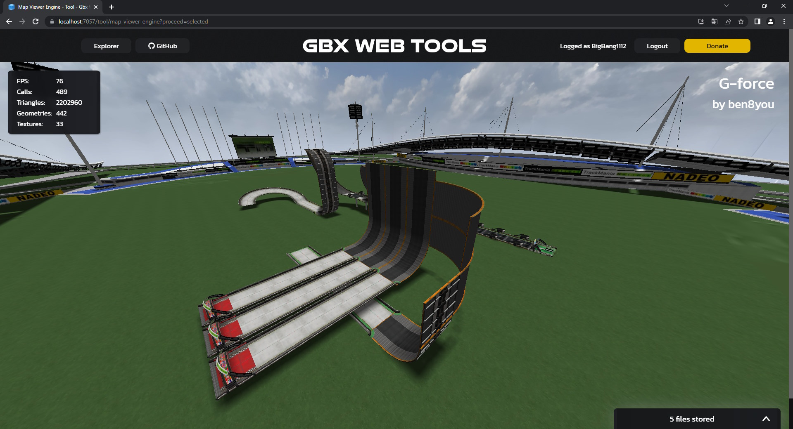
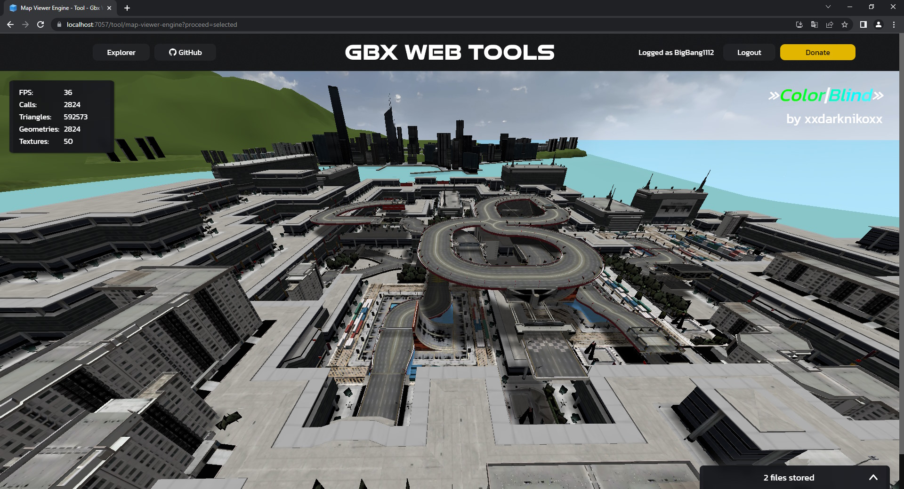

# Map Viewer Engine [(online)](https://gbx.bigbang1112.cz/tool/map-viewer-engine)

## DEPRECATED! See http://3d.gbx.tools/view/map

Hosted on [Gbx Web Tools](https://github.com/bigbang1112-cz/gbx), lives on [Gbx Tool API](https://github.com/bigbang1112-cz/gbx-tool-api), internally powered by [GBX.NET](https://github.com/BigBang1112/gbx-net).

Replay Viewer is a general Trackmania map viewer in a web browser, typically used as a dependency to narrow down the purpose.

It uses THREE.js under the hood.

## Direct TMX link support

```
https://gbx.bigbang1112.cz/tool/map-viewer-engine?proceed=mx?site=tmuf&trackid=123456
```

## Demonstration



